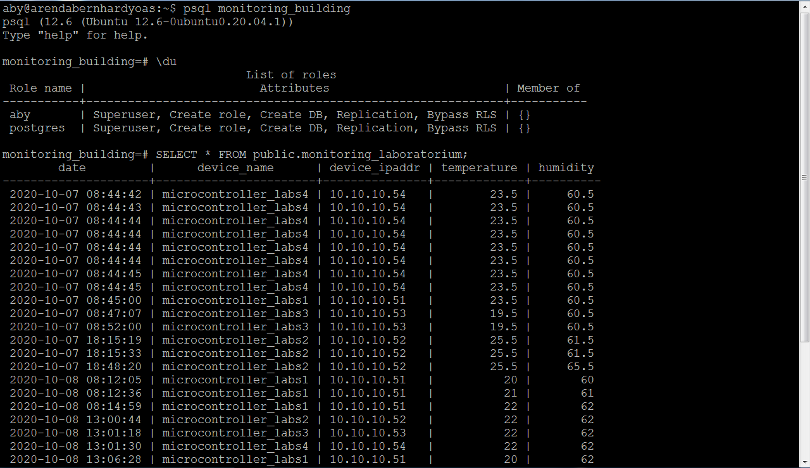
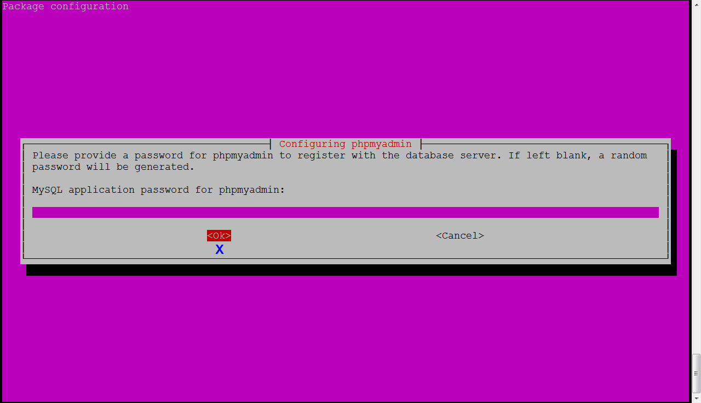
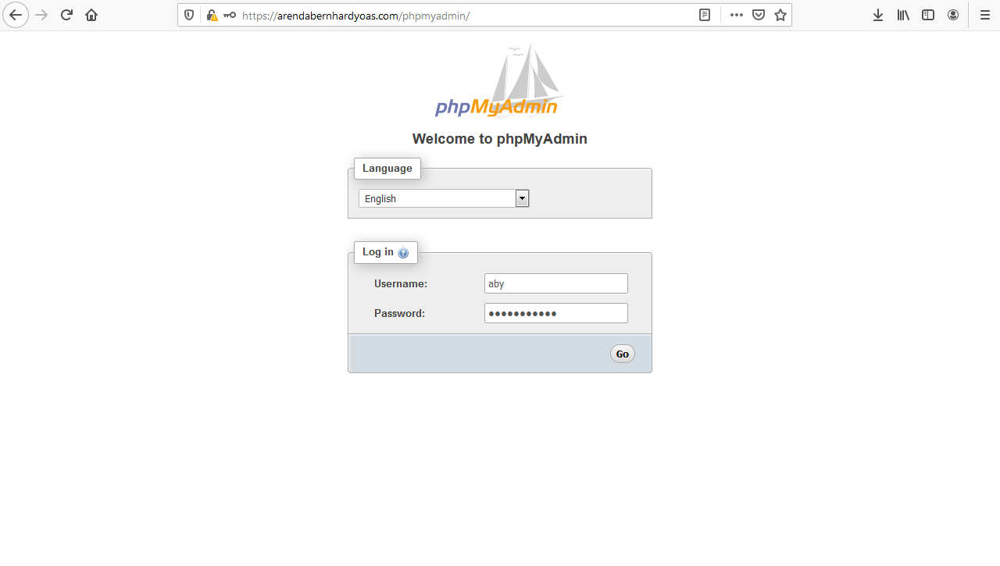
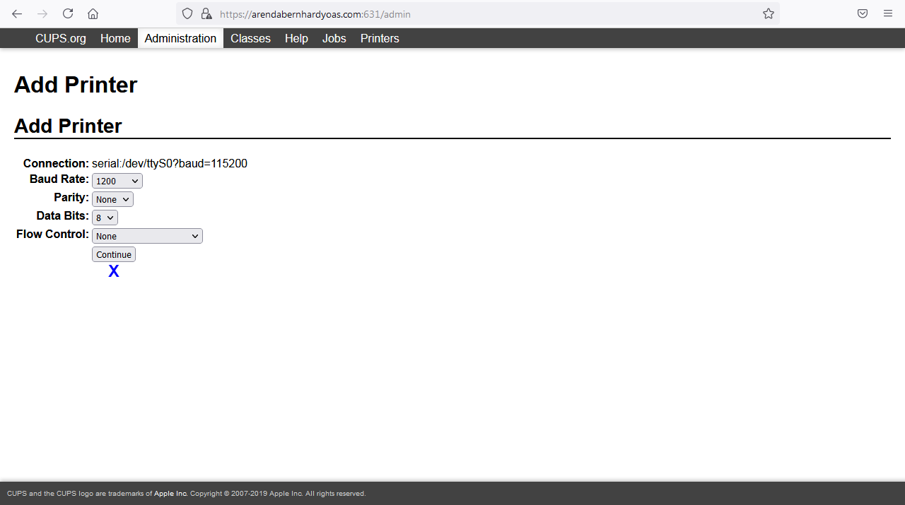

# Ubuntu 20.04: Server

## Build a server with Linux Ubuntu 20.04

### Inital Config
Configure network<br>
`sudo nano /etc/netplan/50-cloud-init.yaml`<br>

`sudo netplan apply`<br>

Update and upgrade packages<br>
`sudo apt-get update`<br>
`sudo apt-get -y full-upgrade`<br>
```
#DHCP config
network:
ethernets:
      eth0:
        dhcp4: true
        optional: true
version: 2
wifis:
      wlan0:
        dhcp4: true
        optional: true
        access-points:
           "SSID name":
              password: "PASSWORD"
```
```
#Static config
network:
ethernets:
      eth0:
        dhcp4: no
        addresses: [172.17.17.250/25]
        gateway4: 172.17.17.172
        nameservers:
           addresses: [172.17.17.172]
version: 2
wifis:
      wlan0:
        dhcp4: no
        addresses: [172.17.17.250/25]
        gateway4: 172.17.17.172
        nameservers:
           addresses: [172.17.17.172]
        access-points:
           "SSID name":
              password: "PASSWORD"
```

### DNS server
Install BIND<br>
`sudo apt-get -y install bind9 bind9utils`<br>
Configure BIND<br>
`sudo nano /etc/bind/named.conf` [file](./configs/named.conf)<br>

`sudo nano /etc/bind/named.conf.options`  [file](./configs/named.conf.options)<br>

`sudo nano /etc/default/named`<br>

`sudo nano /etc/bind/named.conf.arendabernhardyoas`  [file](./configs/named.conf.arendabernhardyoas)<br>

`sudo nano /etc/bind/forward.arendabernhardyoas.com`  [file](./configs/forward.arendabernhardyoas.com)<br>

`sudo nano /etc/bind/reverse.17.17.172`  [file](./configs/reverse.17.17.172)<br>

`sudo systemctl restart named`<br>
Set name server<br>
`sudo nano /etc/netplan/50-cloud-init.yaml`<br>

`sudo netplan apply`<br>
Not mandatory configuration<br>
`sudo nano /etc/resolv.conf`<br>

Verify Configurations<br>

`dig arendabernhardyoas.com`<br>

`dig -x 172.17.17.250`<br>


### Web Server Apache
Install apache2<br>
`sudo apt-get -y install apache2`<br>
Install PHP<br>
`sudo apt-get -y install php php-cgi php-pear php-mbstring libapache2-mod-php php-common`<br>
Configure apache2<br>
`sudo chown -R aby:aby /var/www/`<br>
`sudo nano /etc/apache2/apache2.conf`  [file](./configs/apache2.conf)<br>

`sudo nano /etc/apache2/mods-enabled/status.conf` [file](./configs/status.conf)<br>

`sudo nano /etc/apache2/conf-enabled/security.conf` [file](./configs/security.conf)<br>

`sudo nano /etc/apache2/sites-enabled/000-default.conf` [file](./configs/000-default.conf)<br>

Configure apache2 SSL/TLS<br>
`sudo nano /etc/apache2/sites-available/default-ssl.conf` [file](./configs/default-ssl.conf)<br>


`sudo nano /etc/apache2/sites-enabled/000-default.conf` [file](./configs/000-default.conf)<br>

`sudo a2enmod ssl`<br>
`sudo a2ensite default-ssl`<br>
`sudo nano /etc/apache2/sites-available/vhost.conf` [file](./configs/vhost.conf)<br>

`sudo a2ensite vhost`<br>
`sudo a2enmod rewrite`<br>
`sudo systemctl restart apache2`<br>
Verify Configurations<br>


### Database PostgreSQL
Install PostgreSQL and phppgadmin<br>
`sudo apt-get -y install postgresql-12 php-pgsql phppgadmin`<br>
Configure PostgreSQL<br>
`sudo nano /etc/postgresql/12/main/postgresql.conf` [file](./configs/postgresql.conf)<br>


`sudo nano /etc/postgresql/12/main/pg_hba.conf` [file](./configs/pg_hba.conf)<br>

Adding address `0.0.0.0/0` can create postgresql connections from anywhere.<br>
`sudo systemctl restart postgresql`<br>
`sudo su - postgres`<br>
`createuser -s -i -d -r -l -w aby`<br>
`psql -c "ALTER ROLE aby WITH PASSWORD '<<password>>';"`<br>
`exit`<br>
`createdb monitoring_building`<br>
`psql monitoring_building`<br>
`create table public.monitoring_laboratorium ("date" timestamp default current_timestamp not null, "device_name" varchar(30) not null, "device_ipaddr" varchar(30) not null, "temperature" float not null, "humidity" float not null);`<br>
`copy public.monitoring_laboratorium from '<<file location>>';`<br>
`ALTER ROLE aby WITH REPLICATION;`<br>
`ALTER ROLE aby WITH BYPASSRLS;`<br>
`\q`<br>
Configure phppgadmin<br>
`sudo nano /etc/phppgadmin/config.inc.php` [file](./configs/config.inc.php)<br>

`sudo nano /etc/apache2/conf-enabled/phppgadmin.conf` [file](./configs/phppgadmin.conf)<br>

`sudo systemctl restart postgresql apache2`<br>
Verify configurations<br>



### Database MariaDB
Install MariaDB<br>
`sudo apt-get -y install mariadb-server php-mysql`<br>
Configure MariaDB<br>
`sudo mysql_secure_installation`<br>


`sudo mariadb`<br>
`create user 'aby'@'%' identified by '<<password>>';`<br>
`grant all privileges on *.* to 'aby'@'%' with grant option;`<br>
`flush privileges;`<br>
`\q`<br>
`mariadb -p`<br>
`create database monitoring_building;`<br>
`CREATE TABLE monitoring_building.monitoring_laboratorium ("date" timestamp NOT NULL DEFAULT current_timestamp(), "device_name" varchar(30) NOT NULL, "device_ipaddr" varchar(30) NOT NULL, "temperature" float NOT NULL, "humidity" float NOT NULL);`<br>
`LOAD DATA LOCAL INFILE '/home/aby/monitoring_laboratorium.txt' INTO TABLE monitoring_building. monitoring_laboratorium;`<br>
`\q`<br>
Install phpmyadmin<br>
`sudo apt-get -y install phpmyadmin`<br>



See `/etc/dbconfig-common/phpmyadmin.conf` or `/etc/phpmyadmin/config-db.php` for a random password of phpmyadmin.<br>
`sudo systemctl restart mariadb apache2`<br>
Verify Configurations<br>





### Web Server NGINX
Install NGINX<br>
`sudo apt-get -y install nginx php7.4-fpm`<br>
Configure NGINX<br>
`sudo nano /etc/nginx/sites-enabled/default`  [file](./configs/default)<br>


Configure NGINX SSL/TLS<br>
`sudo nano /etc/nginx/sites-enabled/default`  [file](./configs/default)<br>


Configure NGINX phpmyadmin and phppgadmin<br>
`sudo ln -s /usr/share/phppgadmin/ /var/www/html/`<br>
`sudo ln -s /usr/share/phpmyadmin/ /var/www/html/`<br>

`sudo systemctl restart nginx php7.4-fpm`<br>
Verify Configurations<br>


### Samba
Install samba<br>
`sudo apt-get -y install samba smbclient cifs-utils`<br>
Configure samba<br>
`sudo nano /etc/samba/smb.conf`  [file](./configs/smb.conf)<br>

`sudo smbpasswd -a aby`<br>
`sudo mkdir /home/public`<br>
`sudo chmod -R 777 /home/public`<br>
`sudo chown -R nobody:nogroup /home/public`<br>

Configure printer share<br>
`sudo nano /etc/samba/smb.conf`  [file](./configs/smb.conf)<br>

`sudo systemctl restart smbd nmbd`<br>
Verify configurations<br>
`sudo smbclient '\arendabernhardyoas.com\secure' -U aby`<br>

`sudo smbclient '\arendabernhardyoas.com\public'`<br>


### CUPS (Common UNIX Printing System)
Install CUPS<br>
`sudo apt-get -y install cups`<br>
Configure CUPS<br>
`sudo nano /etc/cups/cupsd.conf` [file](./configs/cupsd.conf)<br>
`sudo systemctl restart cups`<br>
Add local printer<br>





### Mail Server
Install Postfix<br>
`sudo apt-get -y install postfix sasl2-bin`<br>

Configure Postfix<br>
`sudo nano /etc/postfix/main.cf`  [file](./configs/main.cf)<br>


Postfix run SMTP server on tcp port 25<br>
Install Dovecot<br>
`sudo apt-get -y install dovecot-core dovecot-pop3d dovecot-imapd`<br>
Configure Dovecot<br>
`sudo nano /etc/dovecot/dovecot.conf`  [file](./configs/dovecot.conf)<br>

`sudo nano /etc/dovecot/conf.d/10-auth.conf`  [file](./configs/10-auth.conf)<br>


`sudo nano /etc/dovecot/conf.d/10-mail.conf`  [file](./configs/10-mail.conf)<br>

`sudo nano /etc/dovecot/conf.d/10-master.conf`  [file](./configs/10-master.conf)<br>

`sudo nano /etc/dovecot/conf.d/10-ssl.conf`  [file](./configs/10-ssl.conf)<br>

Dovecot run POP service on tcp port 110 and IMAP on tcp port 143<br>
Configure mail account<br>
`sudo apt-get -y install mailutils`<br>
`sudo nano /etc/profile.d/mail.sh`<br>

`sudo systemctl restart postfix dovecot`<br>
Verify configurations<br>


### Other Config
Create SSL certificates self-sign<br>
`sudo openssl genrsa -aes128 -out /etc/ssl/private/server.key 2048`<br>
`sudo openssl rsa -in /etc/ssl/private/server.key -out /etc/ssl/private/server.key`<br>
`sudo openssl req -new -days 365 -key /etc/ssl/private/server.key -out /etc/ssl/private/server.csr`<br>
`sudo openssl x509 -in /etc/ssl/private/server.csr -out /etc/ssl/private/server.crt -req -signkey /etc/ssl/private/server.key -days 365`<br>


** **

**NOTE:**<br>
Download Ubuntu Server ARM Raspberry Pi [here](https://ubuntu.com/download/raspberry-pi).<br>
Raspberry Pi 4 ARM 64-bit 4GB RAM<br>
MikroTik RB941-2nD
